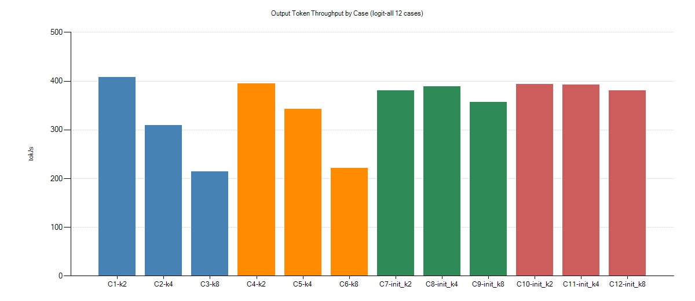
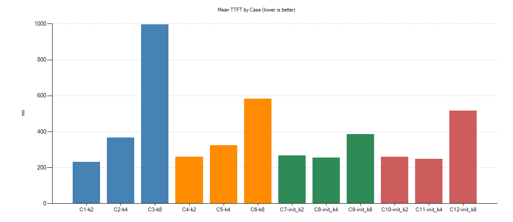
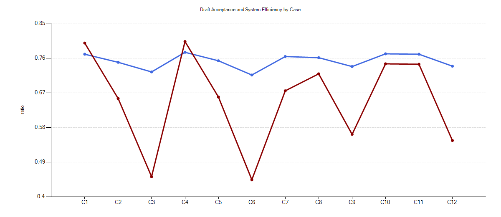
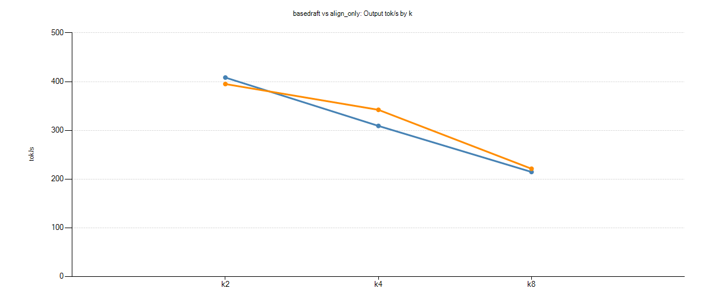
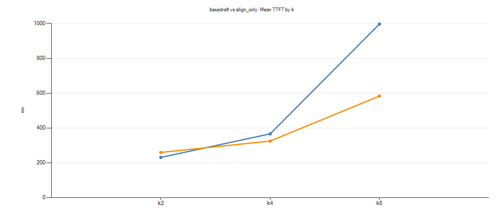
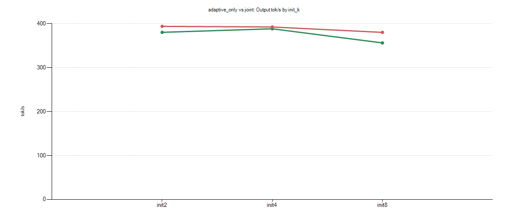
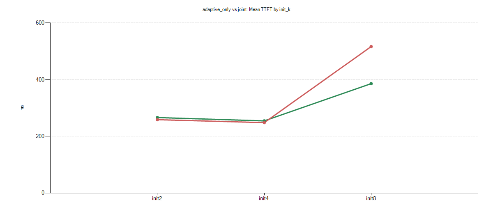
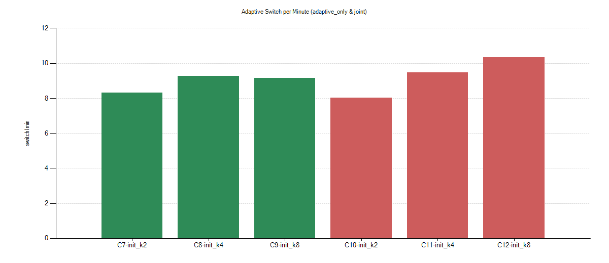
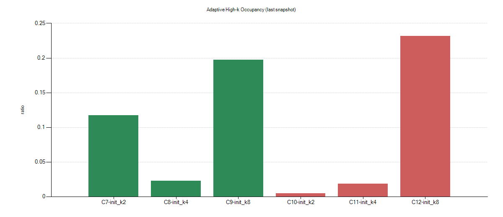
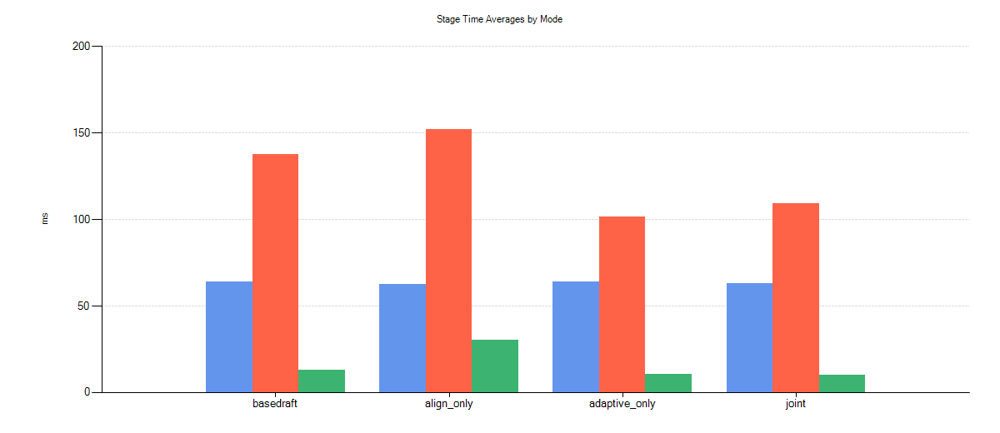

# 模型对齐 1+3 联合实验方案（初学者增强版）

> 版本：v1.2
> 更新时间：2026-03-10
> 适用范围：`Qwen3-8B(target) + Qwen3-0.6B(draft)`，NPU 端 V0 `draft_model` spec-decode
> 约束：本文以“先跑通、再优化”为主，已补充关键源码嵌入与原理说明

---

## 0. 初学者快速导航（先看这个）

如果你是第一次做这个方向，建议按这个最短路径执行：

1. 先只跑 `Phase 0`，确认脚本和日志链路正常；
2. 只做 `Phase 1` 的 `temperature` 模式（不要一开始就上 affine）；
3. 在 `k=2` 和 `k=4` 各找一个稳定温度后，再进入 `Phase 2/3`。

一句话目标：

- 先学会判断“对齐有没有效果”；
- 再做“对齐 + adaptive-k 联动”。

---

## 1. 背景与目标

本方案对应两个优化方向的联合验证：

1. 方向 1：`logit` 分布对齐（draft 侧校准）
2. 方向 3：对齐感知的 `adaptive-k` 控制

联合目标：

- 在不显著恶化延迟的前提下，提高 `accept_rate` 与有效吞吐；
- 降低高 `k` 场景下的尾延迟风险和控制器抖动；
- 形成可复现、可比较、可写入毕设正文的实验证据链。

---

## 2. 代码锚点（本方案依赖的现有能力）

### 2.1 方向 1：logit 对齐入口

- `vllm-ascend/vllm_ascend/worker/draft_model_runner.py`
  - `_align_logits(...)`
  - 环境变量：
    - `VLLM_ASCEND_DRAFT_ALIGN_ENABLE`
    - `VLLM_ASCEND_DRAFT_ALIGN_MODE`
    - `VLLM_ASCEND_DRAFT_ALIGN_TEMPERATURE`
    - `VLLM_ASCEND_DRAFT_ALIGN_SCALE`
    - `VLLM_ASCEND_DRAFT_ALIGN_BIAS`
    - `VLLM_ASCEND_DRAFT_ALIGN_VOCAB_BIAS_PATH`

### 2.1.1 给初学者：什么是 logits 对齐

- `logits` 是 softmax 前的原始分数；
- draft 模型分布通常比 target 偏“尖”或偏“平”；
- 通过温度/仿射把 draft 的分布调得更接近 target，可提升被验收概率（`accept_rate`）。

可理解为：

- 你不是改 token 本身，而是在“采样前”改 token 的相对偏好强度。

### 2.1.2 三种模式怎么选（初学者版）


| 模式                      | 含义                      | 推荐程度   | 适用阶段         |
| ------------------------- | ------------------------- | ---------- | ---------------- |
| `temperature`             | `logits / T`              | 高（首选） | 第一轮所有实验   |
| `temperature_then_affine` | 先温度，再`*scale + bias` | 中         | 温度稳定后做微调 |
| `legacy_affine`           | 直接`*scale + bias`       | 低         | 仅做对照         |

重要提醒：

- “全词表同一个常数 bias”通常不会改变 softmax 后概率排序，不能指望靠它带来实质收益。

### 2.1.3 初学者安全参数区间

- `temperature`: `0.90 ~ 1.10`（先从 `0.95/1.00/1.05` 起）
- `scale`: `0.98 ~ 1.02`（只在 `temperature_then_affine` 用）
- `bias`: `0.0`（先固定）

---

运行脚本：

```
export FIXED_K_LIST_STR=4
export ALIGN_LOG_INTERVAL=200

# logits（仅对齐，固定 k=4）

export RUN_A0=0
export RUN_A1=0
export RUN_A2=1

export VLLM_ASCEND_ADAPTIVE_K_ENABLE=0
export VLLM_ASCEND_DRAFT_ALIGN_MODE=temperature
export VLLM_ASCEND_DRAFT_ALIGN_TEMPERATURE=0.95
export VLLM_ASCEND_DRAFT_ALIGN_SCALE=1.0
export VLLM_ASCEND_DRAFT_ALIGN_BIAS=0.0
# export VLLM_ASCEND_DRAFT_ALIGN_VOCAB_BIAS_PATH=/path/to/bias.json

bash scripts/model_alignment_bench_v2.sh


# adaptive-k（仅自适应，k 以 4 为起点）


export RUN_A0=0
export RUN_A1=1
export RUN_A2=0

export VLLM_ASCEND_ADAPTIVE_K_ENABLE=1
export VLLM_ASCEND_ADAPTIVE_ENABLE_UTILITY=1
export VLLM_ASCEND_ADAPTIVE_K_INIT=4
export VLLM_ASCEND_ADAPTIVE_K_MIN=2
export VLLM_ASCEND_ADAPTIVE_K_MAX=4

bash scripts/model_alignment_bench_v2.sh


# logits + adaptive-k（联合）


export RUN_A0=0
export RUN_A1=0
export RUN_A2=1

export VLLM_ASCEND_DRAFT_ALIGN_MODE=temperature
export VLLM_ASCEND_DRAFT_ALIGN_TEMPERATURE=0.95
export VLLM_ASCEND_DRAFT_ALIGN_SCALE=1.0
export VLLM_ASCEND_DRAFT_ALIGN_BIAS=0.0

export VLLM_ASCEND_ADAPTIVE_K_ENABLE=1
export VLLM_ASCEND_ADAPTIVE_ENABLE_UTILITY=1
export VLLM_ASCEND_ADAPTIVE_K_INIT=4
export VLLM_ASCEND_ADAPTIVE_K_MIN=2
export VLLM_ASCEND_ADAPTIVE_K_MAX=4

bash scripts/model_alignment_bench_v2.sh
```


### 2.2 方向 3：adaptive-k 入口

- `vllm/vllm/spec_decode/spec_decode_worker.py`
  - `_maybe_update_adaptive_k(...)`
  - `_update_k_ewma(...)`
  - `_select_k_by_utility(...)`
  - 现有可观测日志：
    - `P1P2 k=... step_accept=... waste_ratio=...`
    - `AdaptiveK update: ...`
    - `AdaptiveK utility switch: ...`
    - `ALIGN P1/P2 hs_ratio=...`

### 2.3 基线脚本

- `scripts/model_alignment_bench.sh`
- `scripts/model_alignment_bench_v2.sh`

### 2.4 关键源码实现（嵌入版）

> 本节把“方向 1（logits）+ 方向 3（adaptive-k）”的关键实现直接嵌入，便于你在实验报告中做到“原理-代码-结果”一一对应。

#### 2.4.1 方向 1：logits 对齐实现（`draft_model_runner.py`）

1) 对齐参数读取与能力探测（初始化）

```python
self._align_enable = os.getenv("VLLM_ASCEND_DRAFT_ALIGN_ENABLE", "0") == "1"
self._align_mode = os.getenv("VLLM_ASCEND_DRAFT_ALIGN_MODE",
                             "temperature").strip().lower()
self._align_temperature = self._read_float_env(
    "VLLM_ASCEND_DRAFT_ALIGN_TEMPERATURE", 1.0, min_value=1e-6)
self._align_scale = self._read_float_env("VLLM_ASCEND_DRAFT_ALIGN_SCALE", 1.0)
self._align_bias = self._read_float_env("VLLM_ASCEND_DRAFT_ALIGN_BIAS", 0.0)
self._align_vocab_bias_path = os.getenv(
    "VLLM_ASCEND_DRAFT_ALIGN_VOCAB_BIAS_PATH", "").strip()
```

原理解释：

- 这里把“实验可控参数”转成运行时状态，等价于把论文中的超参数定义映射到代码；
- `temperature` 有下限保护（`min_value=1e-6`），避免除零或极端放大；
- 词表偏置 `vocab_bias` 支持外部文件注入，便于做“词级校准”扩展实验。

2) `previous_hidden_states` 是否可传给模型（关键现实修正）

```python
def _model_supports_previous_hidden_states(self) -> bool:
    forward_fn = getattr(self.model, "forward", None)
    sig = inspect.signature(forward_fn)
    if "previous_hidden_states" in sig.parameters:
        return True
    if any(p.kind == inspect.Parameter.VAR_KEYWORD
           for p in sig.parameters.values()):
        return True
    return False
```

原理解释：

- 你前面指出“Qwen3 forward 本身不接 `previous_hidden_states`”，这段就是对应的工程化保护；
- 目标是防止“统计上 hs_available 高”被误读成“模型前向真的用了 hs”；
- 所以结论写作时应强调：当前收益主要来自分布对齐，而非显式 hs 条件化。

3) logits 变换核心

```python
def _align_logits(self, logits: torch.Tensor) -> torch.Tensor:
    if not self._align_enable:
        return logits

    mode = self._align_mode
    if mode == "temperature":
        logits = logits / self._align_temperature
    elif mode == "legacy_affine":
        logits = logits * self._align_scale + self._align_bias
    else:  # temperature_then_affine
        logits = logits / self._align_temperature
        logits = logits * self._align_scale + self._align_bias

    vocab_bias = self._get_vocab_bias_for_logits(logits)
    if vocab_bias is not None:
        logits = logits + vocab_bias
    return logits
```

原理解释：

- `temperature` 调整分布“尖/平”程度；
- `affine` 调整全局尺度和偏置，属于线性校准；
- `vocab_bias` 是 token 级纠偏（可以看作“按词表方向做误差补偿”）。

4) 在采样前真正生效

```python
logits = self.model.compute_logits(...)
logits = self._align_logits(logits)
output = self.model_runner.sampler(logits=logits, ...)
```

原理解释：

- 放在 sampler 之前，确保直接影响 draft 的 token proposal 分布；
- 因此会通过 acceptance 机制间接影响 `accept_rate / throughput / p95`。

5) NPU 兼容点（你本次遇到的报错对应）

```python
use_cuda_graph = bool(
    getattr(model_input.attn_metadata, "use_cuda_graph", False))
```

原理解释：

- Ascend 的 metadata 不一定有 `use_cuda_graph` 字段；
- 这里安全降级为 `False`，避免 `AttributeError`。

#### 2.4.2 方向 3：adaptive-k 实现（`spec_decode_worker.py`）

1) 每步统计 `step_accept` 与 `waste_ratio`

```python
accepted_spec = (accepted_token_ids[spec_indices, :-1] != -1)
step_accept = accepted_spec.float().mean(dim=0)  # [k]
accepted_cnt = accepted_spec.sum().item()
proposed_cnt = accepted_spec.numel()
waste_ratio = 1.0 - accepted_cnt / max(proposed_cnt, 1)
```

原理解释：

- `step_accept[i]` 表示第 `i` 个 speculative 位置被接受的概率估计；
- `waste_ratio` 表示提议但未被接收的比例；
- 两者共同刻画“当前 k 是否过大”。

2) 规则控制器（快降慢升）

```python
if k >= 4 and (waste_ratio > self.adaptive_waste_high or pos4 < self.adaptive_p4_low):
    new_k = max(k - 1, k_min)
elif k >= 3 and (waste_ratio > self.adaptive_waste_mid or pos3 < self.adaptive_p3_low):
    new_k = max(k - 1, k_min)
elif (k < k_max and queue_depth >= self.adaptive_queue_up
      and waste_ratio < self.adaptive_waste_low and pos2 > self.adaptive_p2_high):
    new_k = min(k + 1, k_max)
```

原理解释：

- “快降”：一旦高位接受率差或浪费高，立即减 k，优先保尾延迟；
- “慢升”：需要同时满足队列压力和低浪费条件才升 k，避免抖动。

3) utility 选择器（EWMA + 期望收益）

```python
expected_emit = 1 + a1 + a1*a2 + a1*a2*a3 + ...
total_ms = proposal_per_tok * k + scoring_ms + verify_ms
utility = expected_emit / total_ms
```

原理解释：

- 本质是单位时间产出最大化；
- 用 EWMA 平滑 `step_accept` 和 stage time，降低瞬时噪声带来的误切换；
- `switch_margin + min_dwell_steps` 约束切换频率。

4) 显式联动（Phase 4，可开关）

```python
align_score = w1 * pos2 + w2 * (1 - waste) + w3 * delta_accept_hs
if align_score < low_th:
    align_cap = cap_low
elif align_score > high_th and queue_depth >= queue_up:
    align_cap = cap_high
```

原理解释：

- 这是“对齐质量 -> 控制上界”的最小联动路径；
- 若对齐质量差，主动限制高 k；若质量好且负载高，放开 k；
- 该功能默认关闭，不影响你先做 Phase 0~3。

5) 空 speculative 行的健壮性修复

```python
step_accept = torch.empty(0, dtype=torch.float32)
if step_accept.numel() > 0:
    self._update_k_ewma(...)
```

原理解释：

- 避免“当前步无 speculative 行”时变量未定义；
- 保证控制器在混合场景（prefill/decode 切换）稳定运行。

#### 2.4.3 日志与结果落盘（`model_alignment_bench.sh`）

关键新增采集字段：

- logits 侧：`align_mode / align_temperature / align_vocab_bias_path`
- 运行态确认：`runner_align_* / supports_previous_hidden_states`
- 控制器侧：`adaptive_switch_per_min / adaptive_high_k_occ / adaptive_hist`
- 显式联动侧：`adaptive_align_score / adaptive_delta_hs / adaptive_align_cap`

原理解释：

- 这些字段把“配置值”和“实际生效值”分开记录；
- 报告写作时可以证明：你不是只改了环境变量，而是真正在运行态生效。

---

## 3. 关键前提（必须先明确）

对于当前 `Qwen3-8B + Qwen3-0.6B` 组合：

- 存在 `hidden_states` 传递/统计链路；
- 但 `Qwen3` 的 `forward` 不接 `previous_hidden_states` 参数；
- 因此 `hs_available_ratio` 上升，不直接等价于“draft 前向显式使用 hs 条件化”。

这会影响实验解释：

- 方向 1 的主要收益来源应理解为“输出分布对齐”；
- 方向 3 的主要收益来源应理解为“控制策略更稳健”；
- 不应把结果表述为“已完成显式 hidden-state 条件化对齐”。

---

## 4. 研究假设（用于实验判定）

### H1（方向 1）

开启温度类对齐后，`accept_rate` 可提升，且 `iter_latency_ms_p95` 增幅可控。

### H2（方向 3）

在相同负载下，对齐信息与 `adaptive-k` 联动可减少高 `k` 误用，降低尾延迟。

### H3（联合 1+3）

相较单独方向，联合策略在吞吐-时延-接受率三指标上更接近 Pareto 最优。

---

## 5. 指标体系（统一口径）

### 5.1 主指标

- `throughput_tps = accepted_tokens_total / elapsed_seconds`
- `iter_latency_ms_p50/p95 = percentile(spec_step_latency_ms)`
- `accept_rate = accepted_tokens_total / max(proposed_tokens_total, 1)`

### 5.2 对齐指标

- `hidden_states_available_ratio`
- `accept_rate_with_hs`
- `accept_rate_no_hs`
- `delta_accept_hs = accept_rate_with_hs - accept_rate_no_hs`

### 5.3 控制器指标

- `k_histogram`（不同 k 的步数分布）
- `switch_count_per_min`
- `avg_dwell_steps`
- `high_k_occupancy`（例如 k>=4 的占比）

### 5.4 可选补充指标

- `system_efficiency`
- `avg_time_per_proposal_tok_ms / scoring_time_ms / verification_time_ms`

### 5.5 初学者最少要看哪几个

如果你时间有限，至少看这 3 个：

1. `accept_rate`
2. `iter_latency_ms_p95`
3. `throughput_tps`

判定原则：

- 不能只看吞吐，也不能只看接受率；
- 三者至少要满足“两个变好、一个不明显变差”。

---

## 6. 实验分阶段设计

## Phase 0：基线与可观测性校验（必须先跑）

目标：

- 确认日志/指标链路完整；
- 产出 A0/A1/A2 基线可对照结果。

执行：

- 使用 `scripts/model_alignment_bench_v2.sh`
- `FIXED_K_LIST_STR=2,4,8`
- 每个 case 至少 3 次重复

通过条件：

- `summary.csv` 正常落盘；
- server log 中能检索到 `ALIGN P1/P2` 与 `P1P2` 相关行。

---

## Phase 1：方向 1（logit 分布对齐）单独消融

目标：

- 在固定 k 下隔离对齐模块收益；
- 找到稳定的校准参数区间。

### Phase 1-A：新手第一轮（先跑通）

只做这 4 个 case（最小集合）：

1. `k=2, align=off`
2. `k=2, mode=temperature, T=0.95`
3. `k=4, align=off`
4. `k=4, mode=temperature, T=0.95`

这一步的目标不是找最优，而是确认：

- 对齐开关确实生效；
- 你会读结果，不会跑偏。

### Phase 1-B：粗扫（推荐）

建议只用固定 k 先做：

- `k=2`、`k=4`（优先）
- `force_hs=1`（统一为 A1/A2 口径）

实验矩阵（第一轮粗扫）：

- `align_enable`: `0/1`
- `align_mode`: `temperature`
- `temperature`: `0.90/0.95/1.00/1.05`

### Phase 1-C：进阶微调

在温度模式稳定后，再加：

- `align_mode = temperature_then_affine`
- `scale = 0.98/1.00/1.02`
- `bias = 0.0`

第二轮细扫（围绕第一轮最优）：

- `temperature` 以 `0.01~0.02` 步长做局部扫描

### Phase 1-D：结果如何判断（新手判读表）


| 现象                             | 可能原因                          | 建议动作                           |
| -------------------------------- | --------------------------------- | ---------------------------------- |
| `accept_rate` 升、`p95` 基本不变 | 对齐有效                          | 记录为候选最优                     |
| `accept_rate` 升但 `p95` 明显升  | 分布变“过尖/过平”导致尾延迟开销 | 把 T 往 1.0 回调                   |
| `accept_rate` 降                 | T 方向可能错了                    | 若 T<1，尝试增大；若 T>1，尝试减小 |
| 吞吐升但接受率降很多             | 可能在偷吞吐（质量退化）          | 不作为最终配置                     |
| 指标几乎都不变                   | 对齐力度太小或未生效              | 检查环境变量和日志                 |

阶段输出：

- 每个 k 的“accept_rate vs temperature”曲线
- 每个 k 的“throughput_tps vs iter_p95”散点图
- 每个 case 的均值/标准差表

---

## Phase 2：方向 3（adaptive-k）单独消融

目标：

- 不开启对齐时，得到 adaptive-k 的稳定基线；
- 识别抖动和高 k 误判场景。

推荐矩阵：

- `VLLM_ASCEND_ADAPTIVE_K_ENABLE=1`
- `VLLM_ASCEND_ADAPTIVE_ENABLE_UTILITY=0/1`
- `VLLM_ASCEND_ADAPTIVE_K_INIT=2/4`
- `VLLM_ASCEND_ADAPTIVE_K_MAX=4/8`
- 其余阈值先用当前默认

阶段输出：

- `k_histogram`
- `switch_count_per_min`
- `high_k_occupancy`
- 三主指标对照

---

## Phase 3：联合 1+3（隐式联动，不改控制器公式）

目标：

- 把 Phase 1 最优对齐参数叠加到 Phase 2 最优 adaptive-k 参数；
- 验证“分布对齐”是否能间接改善 adaptive-k 的决策面。

对比组：

1. `B_base`: adaptive-k only（Phase 2 最优）
2. `B_align`: fixed-k + alignment（Phase 1 最优）
3. `B_joint`: adaptive-k + alignment（联合）

重点观察：

- `B_joint` 是否同时改善 `accept_rate` 与 `iter_p95`
- `B_joint` 的 `switch_count_per_min` 是否下降

---

## Phase 4：联合 1+3（显式联动，需最小代码改动，后续可选）

目标：

- 在 `adaptive-k` 决策中显式引入“对齐质量分数”。

建议对齐分数（示例）：

- `align_score = w1 * pos2_accept_ewma + w2 * (1 - waste_ewma) + w3 * delta_accept_hs_ewma`

联动规则（示例）：

- 若 `align_score < low_th`，限制 `k_max=2/3`
- 若 `align_score > high_th` 且队列深度充足，允许上探 `k=4`
- 保持 `min_dwell_steps` 与 `switch_margin` 防抖

说明：

- 该阶段是“扩展实验”，不影响前 3 个阶段先产出论文可用结果。

---

## 7. 实验命令模板（可直接复用）

## 7.0 新手最小跑通命令（建议先跑）

```bash
export RUN_A0=0
export RUN_A1=1
export RUN_A2=1
export FIXED_K_LIST_STR=2,4
export ALIGN_LOG_INTERVAL=200

# 先只用 temperature
export VLLM_ASCEND_DRAFT_ALIGN_MODE=temperature
export VLLM_ASCEND_DRAFT_ALIGN_TEMPERATURE=0.95
export VLLM_ASCEND_DRAFT_ALIGN_SCALE=1.0
export VLLM_ASCEND_DRAFT_ALIGN_BIAS=0.0

bash scripts/model_alignment_bench_v2.sh
```

## 7.1 方向 1 粗扫（示例）

```bash
export RUN_A0=0
export RUN_A1=1
export RUN_A2=1
export FIXED_K_LIST_STR=2,4
export ALIGN_LOG_INTERVAL=200
export VLLM_ASCEND_SPEC_FORCE_RETURN_HS=1

for T in 0.90 0.95 1.00 1.05; do
  export VLLM_ASCEND_DRAFT_ALIGN_MODE=temperature
  export VLLM_ASCEND_DRAFT_ALIGN_TEMPERATURE=$T
  export VLLM_ASCEND_DRAFT_ALIGN_SCALE=1.00
  export VLLM_ASCEND_DRAFT_ALIGN_BIAS=0.0
  bash scripts/model_alignment_bench_v2.sh
done
```

## 7.2 方向 1 进阶（加 affine）

```bash
for T in 0.94 0.96 0.98; do
  for S in 0.98 1.00 1.02; do
    export VLLM_ASCEND_DRAFT_ALIGN_MODE=temperature_then_affine
    export VLLM_ASCEND_DRAFT_ALIGN_TEMPERATURE=$T
    export VLLM_ASCEND_DRAFT_ALIGN_SCALE=$S
    export VLLM_ASCEND_DRAFT_ALIGN_BIAS=0.0
    bash scripts/model_alignment_bench_v2.sh
  done
done
```

## 7.3 方向 3 消融（示例）

```bash
export VLLM_ASCEND_ADAPTIVE_K_ENABLE=1
export VLLM_ASCEND_ADAPTIVE_ENABLE_UTILITY=1
export VLLM_ASCEND_ADAPTIVE_K_INIT=4
export VLLM_ASCEND_ADAPTIVE_K_MIN=2
export VLLM_ASCEND_ADAPTIVE_K_MAX=8
export VLLM_ASCEND_ADAPTIVE_MIN_DWELL_STEPS=12
export VLLM_ASCEND_ADAPTIVE_SWITCH_MARGIN=0.03

bash scripts/model_alignment_bench_v2.sh
```

## 7.4 日志抽取建议

```bash
grep -E "ALIGN P1/P2|P1P2|AdaptiveK update|AdaptiveK utility switch|Draft acceptance rate|System efficiency" \
  logs/*/server_*.log > logs/key_lines.txt
```

---

## 8. 结果表模板（建议直接复制到实验报告）

### 8.1 方向 1（固定 k）


| Case | k | mode | T | scale | throughput_tps | iter_p95_ms | accept_rate | delta_accept_hs |
| ---- | -: | ---- | -: | ----: | -------------: | ----------: | ----------: | --------------: |
|      |   |      |   |       |                |             |             |                 |

### 8.2 方向 3（adaptive-k）


| Case | init_k | k_max | utility | throughput_tps | iter_p95_ms | accept_rate | switch/min | high_k_occ |
| ---- | -----: | ----: | ------: | -------------: | ----------: | ----------: | ---------: | ---------: |
|      |        |       |         |                |             |             |            |            |

### 8.3 联合 1+3


| Case    | 配置             | throughput_tps | iter_p95_ms | accept_rate | switch/min | 结论 |
| ------- | ---------------- | -------------: | ----------: | ----------: | ---------: | ---- |
| B_base  | adaptive only    |                |             |             |            |      |
| B_align | align only       |                |             |             |            |      |
| B_joint | adaptive + align |                |             |             |            |      |

### 8.4 新手实验记录模板（建议）


| 日期 | case_tag | 主要改动 | 结果摘要 | 下一步 |
| ---- | -------- | -------- | -------- | ------ |
|      |          |          |          |        |

### 8.5 已跑数据落表（2026-03-10，logit-all 全量 12 case）

数据来源（本轮唯一口径）：

- `github/Data/logit-all/bench.txt`
- `github/Data/logit-all/serve.txt`
- 去噪后：`github/Data/logit-all/serve.cleaned.txt`
- 结构化汇总：
  - `github/Data/logit-all/case_summary.csv`
  - `github/Data/logit-all/serve_timeseries_summary.csv`
  - `github/Data/logit-all/serve_stage_gen_summary.csv`
  - `github/Data/logit-all/serve_verify_outlier_summary.csv`

执行顺序（与脚本一致）：

1. basedraft: `k2 -> k4 -> k8`
2. align_only: `k2 -> k4 -> k8`
3. adaptive_only: `init_k2 -> init_k4 -> init_k8`（均 `serve_k=8`）
4. joint: `init_k2 -> init_k4 -> init_k8`（均 `serve_k=8`）

#### 8.5.1 日志清洗与完整性检查

| 项目 | 数值 |
| ---- | ---: |
| serve 原始行数 | 10788 |
| 去噪后行数 | 5964 |
| 去除噪声行数（`Received request` + `POST /v1/completions`） | 4824 |
| case 数量（bench/serve） | 12 / 12 |
| 每个 case Successful requests | 200（全部一致） |

#### 8.5.2 12-case 主指标总表（按执行顺序）

| # | mode | 子配置 | baseline | serve_k | init_k | duration(s) | output tok/s | total tok/s | mean TTFT | mean TPOT | mean ITL | p99 TTFT | p99 ITL | draft acc | system eff | ALIGN accept | switch/min |
| -: | ---- | ------ | -------: | ------: | -----: | ----------: | -----------: | ----------: | --------: | --------: | -------: | -------: | ------: | --------: | ---------: | -----------: | ---------: |
| 1 | basedraft | k2 | A0 | 2 | - | 109.46 | 408.36 | 806.33 | 231.07 | 257.52 | 356.93 | 462.15 | 2099.79 | 0.770 | 0.799 | 0.8872 | - |
| 2 | basedraft | k4 | A0 | 4 | - | 144.62 | 309.06 | 610.26 | 366.26 | 292.64 | 565.10 | 1300.54 | 2066.97 | 0.749 | 0.655 | 0.7151 | - |
| 3 | basedraft | k8 | A0 | 8 | - | 208.31 | 214.57 | 423.68 | 996.72 | 539.84 | 1069.13 | 3635.17 | 6549.93 | 0.724 | 0.452 | 0.4865 | - |
| 4 | align_only | k2 | A2 | 2 | - | 113.14 | 395.06 | 780.07 | 259.47 | 237.60 | 357.77 | 460.47 | 2070.93 | 0.775 | 0.803 | 0.8885 | - |
| 5 | align_only | k4 | A2 | 4 | - | 130.65 | 342.10 | 675.51 | 324.76 | 284.41 | 558.45 | 1073.08 | 2741.42 | 0.753 | 0.659 | 0.7203 | - |
| 6 | align_only | k8 | A2 | 8 | - | 202.11 | 221.15 | 436.68 | 583.34 | 545.70 | 1051.81 | 1912.53 | 7664.08 | 0.716 | 0.444 | 0.4794 | - |
| 7 | adaptive_only | init_k2 | A1 | 8 | 2 | 117.41 | 380.40 | 751.42 | 266.41 | 268.86 | 438.81 | 543.96 | 2119.32 | 0.764 | 0.675 | 0.8169 | 8.3276 |
| 8 | adaptive_only | init_k4 | A1 | 8 | 4 | 115.06 | 388.45 | 767.02 | 254.72 | 250.41 | 402.18 | 493.11 | 2072.50 | 0.761 | 0.719 | 0.8401 | 9.2749 |
| 9 | adaptive_only | init_k8 | A1 | 8 | 8 | 125.43 | 356.34 | 703.61 | 386.02 | 375.11 | 540.53 | 1103.43 | 3626.43 | 0.738 | 0.562 | 0.6996 | 9.1587 |
| 10 | joint | init_k2 | A2 | 8 | 2 | 113.43 | 394.03 | 778.04 | 258.91 | 264.42 | 402.17 | 586.31 | 2147.12 | 0.771 | 0.745 | 0.8567 | 8.0183 |
| 11 | joint | init_k4 | A2 | 8 | 4 | 113.86 | 392.57 | 775.15 | 248.53 | 258.77 | 398.29 | 519.09 | 1253.92 | 0.770 | 0.744 | 0.8561 | 9.4633 |
| 12 | joint | init_k8 | A2 | 8 | 8 | 117.53 | 380.29 | 750.91 | 516.77 | 317.66 | 528.71 | 1694.20 | 2155.36 | 0.739 | 0.546 | 0.6795 | 10.3455 |

#### 8.5.3 直接图表（logit-all）





















#### 8.5.4 横向对比（同维度配对）

A) `basedraft` vs `align_only`（同 `k`）

| k | basedraft out_tok/s | align_only out_tok/s | Δout | basedraft TTFT | align_only TTFT | ΔTTFT | basedraft draft_acc | align_only draft_acc |
| -: | ------------------: | -------------------: | ----: | -------------: | --------------: | ----: | ------------------: | -------------------: |
| 2 | 408.36 | 395.06 | -13.30 | 231.07 | 259.47 | +28.40 | 0.770 | 0.775 |
| 4 | 309.06 | 342.10 | +33.04 | 366.26 | 324.76 | -41.50 | 0.749 | 0.753 |
| 8 | 214.57 | 221.15 | +6.58 | 996.72 | 583.34 | -413.38 | 0.724 | 0.716 |

B) `adaptive_only` vs `joint`（同 `init_k`）

| init_k | adaptive_only out_tok/s | joint out_tok/s | Δout | adaptive_only TTFT | joint TTFT | ΔTTFT | adaptive_only draft_acc | joint draft_acc | adaptive_only switch/min | joint switch/min |
| -----: | ----------------------: | --------------: | ----: | -----------------: | ---------: | ----: | ----------------------: | --------------: | -----------------------: | ---------------: |
| 2 | 380.40 | 394.03 | +13.63 | 266.41 | 258.91 | -7.50 | 0.764 | 0.771 | 8.3276 | 8.0183 |
| 4 | 388.45 | 392.57 | +4.12 | 254.72 | 248.53 | -6.19 | 0.761 | 0.770 | 9.2749 | 9.4633 |
| 8 | 356.34 | 380.29 | +23.95 | 386.02 | 516.77 | +130.75 | 0.738 | 0.739 | 9.1587 | 10.3455 |

#### 8.5.5 mode 平均表现（12 case 汇总）

| mode | n | avg output tok/s | avg total tok/s | avg mean TTFT | avg mean TPOT | avg mean ITL | avg draft_acc | avg system_eff | avg ALIGN accept | avg switch/min |
| ---- | -: | ---------------: | --------------: | ------------: | ------------: | -----------: | ------------: | -------------: | ---------------: | -------------: |
| basedraft | 3 | 310.66 | 613.42 | 531.35 | 363.33 | 663.72 | 0.7477 | 0.6353 | 0.6963 | 0 |
| align_only | 3 | 319.44 | 630.75 | 389.19 | 355.90 | 656.01 | 0.7480 | 0.6353 | 0.6961 | 0 |
| adaptive_only | 3 | 375.06 | 740.68 | 302.38 | 298.13 | 460.51 | 0.7543 | 0.6520 | 0.7855 | 8.9204 |
| joint | 3 | 388.96 | 768.03 | 341.40 | 280.28 | 443.06 | 0.7600 | 0.6783 | 0.7974 | 9.2757 |

#### 8.5.6 时序动态指标（来自 serve）

| # | mode | 子配置 | spec_points | 首次 spec 时间(s) | spec 窗口(s) | acc first->last | acc std | ALIGN points | ALIGN last | adp points | utility switch 次数 | adp sw first->last | adp high_k_occ first->last | final hist |
| -: | ---- | ------ | ----------: | ----------------: | -----------: | --------------: | ------: | -----------: | ---------: | --------: | ------------------: | -----------------: | -------------------------: | --------- |
| 1 | basedraft | k2 | 22 | 114 | 113 | 0.500->0.770 | 0.0651 | 2 | 0.8872 | 0 | 0 | - | - | - |
| 2 | basedraft | k4 | 27 | 110 | 146 | 0.500->0.749 | 0.0603 | 1 | 0.7151 | 0 | 0 | - | - | - |
| 3 | basedraft | k8 | 36 | 109 | 219 | 0.500->0.724 | 0.0446 | 1 | 0.4865 | 0 | 0 | - | - | - |
| 4 | align_only | k2 | 22 | 109 | 113 | 0.500->0.775 | 0.0654 | 2 | 0.8885 | 0 | 0 | - | - | - |
| 5 | align_only | k4 | 24 | 111 | 135 | 0.500->0.753 | 0.0632 | 1 | 0.7203 | 0 | 0 | - | - | - |
| 6 | align_only | k8 | 34 | 109 | 214 | 0.500->0.716 | 0.0436 | 1 | 0.4794 | 0 | 0 | - | - | - |
| 7 | adaptive_only | init_k2 | 22 | 116 | 119 | 0.500->0.764 | 0.0616 | 2 | 0.8169 | 40 | 10 | 0.0000->8.3276 | 0.0000->0.1175 | 2:256,3:97,4:47 |
| 8 | adaptive_only | init_k4 | 22 | 110 | 118 | 0.500->0.761 | 0.0655 | 2 | 0.8401 | 44 | 12 | 1.2942->9.2749 | 0.7000->0.0227 | 2:350,3:80,4:10 |
| 9 | adaptive_only | init_k8 | 24 | 111 | 135 | 0.500->0.738 | 0.0549 | 2 | 0.6996 | 40 | 12 | 1.2173->9.1587 | 1.0000->0.1975 | 2:260,3:61,4:8,5:20,6:33,7:11,8:7 |
| 10 | joint | init_k2 | 21 | 111 | 114 | 0.500->0.771 | 0.0650 | 2 | 0.8567 | 42 | 10 | 0.0000->8.0183 | 0.0000->0.0048 | 2:361,3:57,4:2 |
| 11 | joint | init_k4 | 22 | 109 | 118 | 0.500->0.770 | 0.0676 | 2 | 0.8561 | 43 | 12 | 1.3109->9.4633 | 0.7000->0.0186 | 2:357,3:65,4:8 |
| 12 | joint | init_k8 | 23 | 111 | 126 | 0.500->0.739 | 0.0571 | 1 | 0.6795 | 38 | 12 | 1.2647->10.3455 | 1.0000->0.2316 | 2:182,3:110,4:17,5:20,6:33,7:11,8:7 |

#### 8.5.7 stage-time 与生成时序（serve）

| mode | proposal(ms) avg | scoring(ms) avg | verification(ms) avg | Avg generation tps | Peak generation tps | Peak GPU KV cache |
| ---- | ----------------: | --------------: | -------------------: | -----------------: | ------------------: | -----------------: |
| basedraft | 64.43 | 137.62 | 12.89 | 99.2 | 267.0 | 33.7% |
| align_only | 62.61 | 152.28 | 30.04 | 103.3 | 265.0 | 33.6% |
| adaptive_only | 63.95 | 101.37 | 10.29 | 126.3 | 328.0 | 33.8% |
| joint | 63.02 | 109.32 | 10.14 | 135.0 | 346.8 | 31.5% |

#### 8.5.8 异常点排查（verification 尾尖峰）

`align_only-k8` 出现单次 `verification_time_ms=1786.44`，导致其 verification 平均值被显著抬高：

| case | verify_avg(ms) | verify_median(ms) | verify_max(ms) | >100ms 次数 | >500ms 次数 |
| ---- | -------------: | ----------------: | -------------: | ----------: | ----------: |
| align_only-k8 | 70.72 | 11.34 | 1786.44 | 1 | 1 |
| joint-init_k8 | 13.05 | 9.08 | 44.57 | 0 | 0 |
| adaptive_only-init_k8 | 13.15 | 7.94 | 38.77 | 0 | 0 |

结论：`align_only-k8` 的 verification 均值异常主要由单点尖峰驱动，不是整体分布性劣化。

### 8.6 归纳总结（logit-all 全量）

#### 8.6.1 总体结论（全 12 case）

1. 吞吐上限：全局最高是 `basedraft-k2`（408.36 tok/s），但这不是联合策略可复用的动态最优点。  
2. 联合最稳工作点：`joint-init_k2` 与 `joint-init_k4` 在吞吐、TTFT、ITL、accept/eff 上同时靠前；其中 `joint-init_k4` TTFT 最低（248.53ms）。  
3. `init_k=8` 风险明显：`adaptive_only-init_k8` 与 `joint-init_k8` 都出现 TTFT 恶化，`joint-init_k8` 最明显（516.77ms）。  
4. 动态控制有效：adaptive/joint 最终高占比都回落到低 k（`k=2/3` 主导），说明控制器在实际负载下会主动压低高 k。  
5. 对齐与动态并用有增益：按 mode 平均，`joint` 相比 `adaptive_only` 吞吐 +3.71%，TPOT -5.99%，ITL -3.79%，accept +0.57pp，eff +2.63pp。  

#### 8.6.2 分模式解读

A) `basedraft`（固定 k）

- `k` 从 2->8 时吞吐单调下滑（408.36 -> 214.57），TTFT/ITL急剧变差。
- 说明在本负载下固定高 k 不可取，尤其 `k=8` 的尾部代价很高。

B) `align_only`（固定 k + logits）

- `k=2` 相比 basedraft-k2：吞吐小降，accept/eff 略升；
- `k=4` 有明显收益（吞吐 +33.04，TTFT -41.50）；
- `k=8` 在 TTFT 上改善较大，但存在 verification 尖峰风险（见 8.5.8）。

C) `adaptive_only`

- `init_k4` 是三者中综合最优（388.45 tok/s, 254.72ms TTFT）；
- `init_k8` 性能退化，说明高初始 k 会带来更高的早期代价。

D) `joint`

- `init_k2/init_k4` 都优于对应 `adaptive_only`（TTFT 更低，吞吐更高）；
- `init_k8` 吞吐虽提升，但 TTFT 明显恶化（+130.75ms），不建议默认。

#### 8.6.3 关键对比结论（可直接写论文）

1. `align_only vs basedraft`：平均吞吐 +2.82%，平均 TTFT -26.75%，在固定-k 框架下对齐带来可观时延收益。  
2. `adaptive_only vs align_only`：平均吞吐 +17.41%，平均 TTFT -22.30%，动态 k 的主效应明显。  
3. `joint vs adaptive_only`：平均吞吐 +3.71%，平均 TPOT -5.99%，平均 ITL -3.79%，说明联合策略在中后程 token 生成效率更优。  
4. 但 `joint` 的平均 TTFT 被 `init_k8` 拖高（+12.90%）；若限定 `init_k ∈ {2,4}`，joint 的 TTFT 同样优于 adaptive_only。  

#### 8.6.4 对“是否重复跑错”的最终解释

- `A1_k8` 出现 3 次和 `A2_k8` 出现 4 次，不是重复 bug，而是实验矩阵展开结果：
  - `A1_k8`：adaptive_only 对应 `init_k=2/4/8` 三次；
  - `A2_k8`：align_only 的 `k=8` 一次 + joint 的 `init_k=2/4/8` 三次，共四次。
- 由于 `serve_k` 在 adaptive/joint 被固定为 `kmax=8`，日志头只看 `serve_k` 会产生“看似重复”的错觉。

#### 8.6.5 推荐配置（分目标）

1. 吞吐优先：`joint-init_k2`（394.03 tok/s）或 `joint-init_k4`（392.57 tok/s）。  
2. 时延优先：`joint-init_k4`（mean TTFT 248.53ms，p99 ITL 1253.92ms）。  
3. 稳健默认：`joint-init_k4 + kmin=2 + kmax=8`，并在后续加门控限制高初始 k。  
4. 不推荐默认：`init_k=8`（adaptive_only/joint）作为生产起点。  

#### 8.6.6 下一步实验建议（基于本轮证据）

1. 固定 `init_k=4`，扫 `temperature`（0.93~1.00），验证 joint 下是否还能进一步压 TTFT。  
2. 给 `init_k=8` 增加 warmup 限制或更强下压门槛，验证能否消除 TTFT 异常增幅。  
3. 将 `verification_time_ms` 增加分位数监控（p95/p99），防止单尖峰污染均值判断。  
4. 分离“冷启动窗口”和“稳定窗口”分别统计，避免前 100s 初始化阶段掩盖真实 steady-state 表现。  

---

## 9. 判定门槛（Go/No-Go）

建议门槛分两档：

### 9.1 通过线（初学者可接受）

- `accept_rate` 明显提升，且 `iter_latency_ms_p95` 不恶化超过 `5%`；
- 或 `throughput_tps` 提升 `>=2%` 且 `accept_rate` 不下降。

### 9.2 目标线（论文主结果建议）

1. 方向 1 成立：
   `accept_rate` 提升，且 `iter_latency_ms_p95` 增幅不超过 `3%`。
2. 方向 3 成立：
   `switch_count_per_min` 下降（建议 `>=20%`），且吞吐不下降。
3. 联合 1+3 成立：
   相较 `B_base`，满足以下之一：

- `throughput_tps` 提升（建议 `>=3%`）且 `iter_p95` 不恶化；
- `iter_p95` 下降（建议 `>=8%`）且吞吐不恶化。

---

## 10. 风险与规避

1. 风险：把 `hs_available` 误解为“hs 已被 draft 前向消费”。
   规避：文档与结论中明确区分“可用性”和“消费性”。
2. 风险：参数扫描空间过大，实验周期失控。
   规避：先 `temperature` 单变量，再逐步加维度。
3. 风险：动态负载波动导致结论不稳定。
   规避：每 case 至少 3 次重复，报告均值+标准差。
4. 风险：只看吞吐忽略尾延迟。
   规避：所有结论必须同时给出 `throughput + p95 + accept_rate`。
5. 风险：开关看似生效但实际未生效。
   规避：核对 server log 是否打印 align mode/temperature；核对 `summary.csv` 是否有对齐字段。

---

## 11. 建议执行顺序（最短闭环）

1. 跑 Phase 0（预计半天）
2. 跑 Phase 1-A/1-B（预计 1~2 天）
3. 跑 Phase 2（预计 1 天）
4. 跑 Phase 3（预计 1 天）
5. 若时间允许，再做 Phase 4 扩展

---

## 12. 本文档的预期产出

执行完本方案后，至少应形成以下材料：

1. `summary.csv`（原始指标）
2. `key_lines.txt`（关键日志）
3. 三张核心图：

- 对齐参数扫描曲线图
- 吞吐-时延 Pareto 图
- adaptive-k 行为图（k 分布/切换频率）

4. 一页结论摘要：方向 1、方向 3、联合 1+3 的最终推荐配置。

---

## 附录 A：logits 对齐常见问答（初学者）

### Q1：`T < 1` 和 `T > 1` 分别意味着什么？

- `T < 1`：分布更尖锐，模型更“自信”；
- `T > 1`：分布更平滑，模型更“保守”。

### Q2：为什么我加了 `bias` 看起来没变化？

如果是“给全部词同一个常数”，softmax 后概率相对关系几乎不变，效果很弱。

### Q3：我应该先追求最高吞吐吗？

不建议。对齐方向优先保证 `accept_rate + p95` 稳定，再看吞吐。

### Q4：第一次实验最容易犯什么错？

- 一上来做太大网格；
- 不固定 `k` 就比较对齐参数；
- 只跑 1 次就下结论。

### Q5：我应该从哪个模式开始？

默认从 `temperature` 开始；只有在它稳定提升后，才引入 `temperature_then_affine`。

